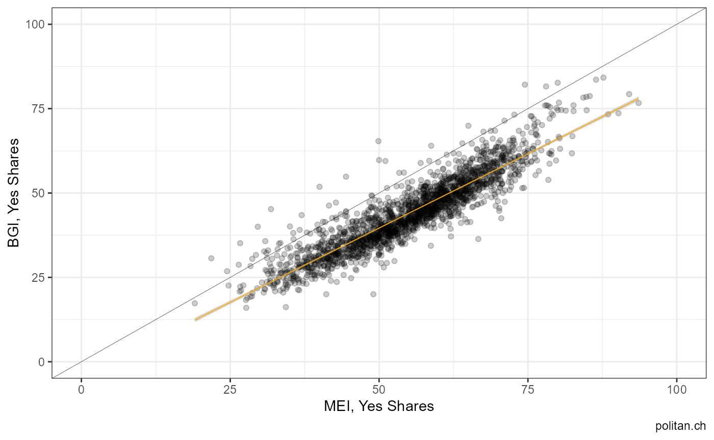

# Find and plot correlated vote results

### What other votes correlate with the 2014 vote on immigration (mei)?

For the sake of illustration we are interested in the result of the 2014
vote on immigration for Swiss municipalities. The initiative was voted
upon on 9th of February 2014. There are different ways to find this
exact vote. One of them is using the information in the title. An other
solution would be to look up the `id` provided by the FSO.

`unique(federalvotes$name[grep("Massen", federalvotes$name)])`

First, we invoke the necessary packages and use the function
`get_nationalvotes` to access the data. We further specify the unit of
analysis as well as the range.

``` r

# installation from CRAN (stable)
# install.packages("swissdd")
# install.packages("dplyr")

# installation from github (ongoing updates)
# devtools::install_github("politanch/swissdd")

library(swissdd)
library(dplyr)
library(ggplot2)
library(tidyr)

#get results of all votes between 2010-2019
federalvotes <- get_nationalvotes(geolevel = "municipality", 
                                  from_date = "2010-03-07", 
                                  to_date = "2020-09-27")

#get correlations for votes on municipal level with mei
simvotes <- similar_votes(federalvotes, id=5800, from=.4, to=.6)
simvotes
#> # A tibble: 4 × 2
#>   id    correlation
#>   <chr>       <dbl>
#> 1 6350        0.591
#> 2 5990        0.563
#> 3 5710        0.494
#> 4 5960        0.454

#extract names of correlated votes
ballotnames <- federalvotes %>%
  dplyr::select(name, id, mun_id)%>%
  filter(id%in%c(5800, simvotes[2,1]))%>%
  distinct(name)


#get correlations for votes on municipal level with mei
simvotes <- similar_votes(federalvotes, id=6310, from=.3, to=1)
simvotes
#> # A tibble: 22 × 2
#>    id    correlation
#>    <chr>       <dbl>
#>  1 5800        0.911
#>  2 5970        0.906
#>  3 6240        0.898
#>  4 5523        0.877
#>  5 5521        0.875
#>  6 5880        0.786
#>  7 5760        0.774
#>  8 5890        0.762
#>  9 5610        0.713
#> 10 5790        0.707
#> # ℹ 12 more rows

#extract names of correlated votes
ballotnames <- federalvotes %>%
  dplyr::select(name, id, mun_id)%>%
  filter(id%in%c(6310, simvotes[1,1]))%>%
  distinct(name)

#subset for correlated votes
corrvotes <- federalvotes %>% 
  filter(id%in%c(6310, simvotes[1,1]))%>%
  dplyr::select(id, jaStimmenInProzent, mun_id)%>%
  mutate(id=as.character(id))

#plot
corrvotes%>%
  pivot_wider(names_from="id", values_from="jaStimmenInProzent")%>%
  ggplot(aes(y=`6310`, x=`5800`))+
  geom_point(alpha=.2)+
  scale_y_continuous(limits=c(0,100))+
  scale_x_continuous(limits=c(0,100))+
  geom_abline(intercept = 0, slope=1,  size=.1)+
  geom_smooth(method="lm", size=.3, color="orange")+
  labs(y="BGI, Yes Shares", x="MEI, Yes Shares", caption="politan.ch")+
  theme_bw()
```


